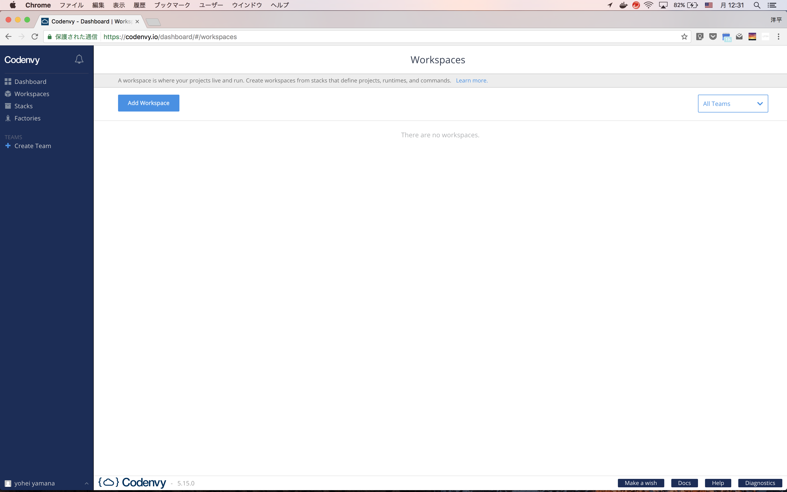
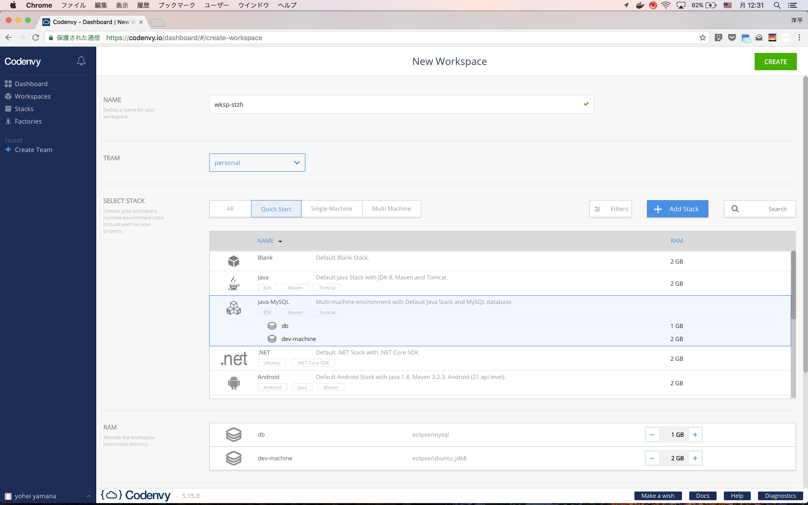
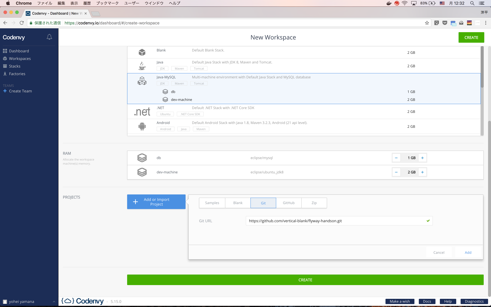
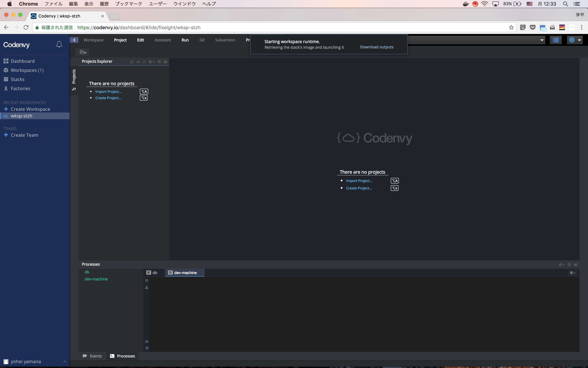
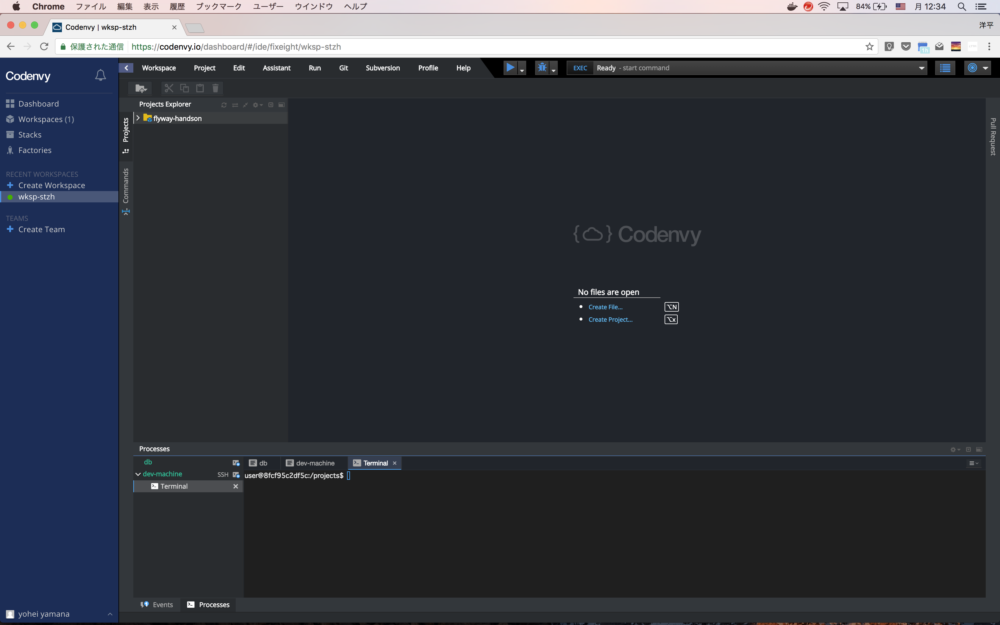
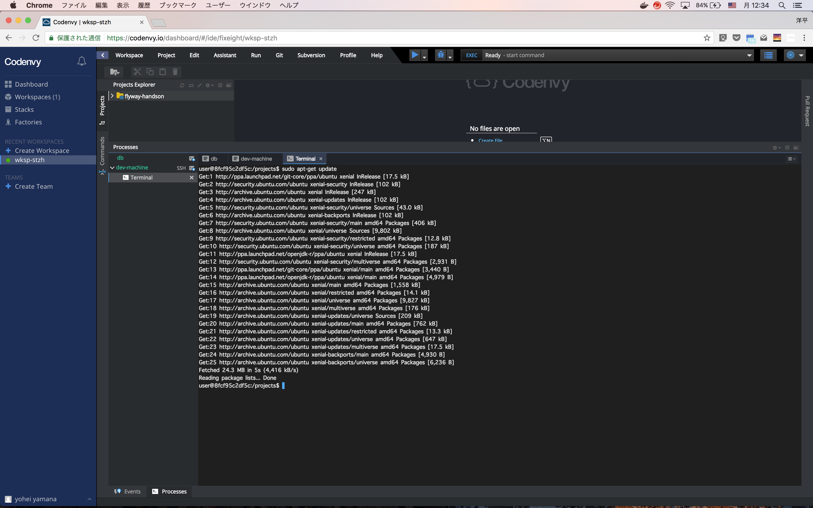

## Workspace作成



- `Add Workspace` をクリック



- `java-MySQL` を選択



- `Git` にこのリポジトリのURL( https://github.com/vertical-blank/flyway-handson.git )をペースト



- しばし待つ



- Workspace作成が完了すると、`dev-machine` のターミナルが開く
- ホスト名 `db` として、MySQLを参照可能



- mysqlコマランドラインクライアントをインストール

```
sudo apt-get update
sudo apt-get install mysql-client -y
```

- `CREATE DATABASE` スクリプトを流す (passは `password` )
```
mysql -h db -u petclinic -p < create_db.sql
```

